<p align="center">
  
</p>

<h1 align="center">Jellyfin Face Swap</h1>

<p align="center">
  <strong>Replace faces on your Jellyfin movie and TV show posters with your friends, family, or anyone else.</strong>
</p>

<p align="center">
  <a href="#quick-start">Quick Start</a> &bull;
  <a href="#walkthrough">Walkthrough</a> &bull;
  <a href="#web-ui">Web UI</a> &bull;
  <a href="#cli">CLI</a> &bull;
  <a href="#batch-mode">Batch Mode</a> &bull;
  <a href="#configuration">Configuration</a>
</p>

<p align="center">
  
  
  
  
</p>

---

## What Is This?

Jellyfin Face Swap automatically detects faces in your media library posters and replaces them with faces you provide. It works on **poster** images across your entire movie and TV show collection.

**How it works:**
1. AI analyzes each poster to find faces and identify the most prominent person
2. A replacement face is selected from your collection (round-robin by gender)
3. AI generates a new poster with the face swapped, matching lighting and style
4. The new poster is uploaded back to Jellyfin

Your originals are always backed up locally before any changes are made.

## Quick Start

### Prerequisites

- A running [Jellyfin](https://jellyfin.org/) server
- A [Google AI API key](https://aistudio.google.com/apikey) (for Gemini)
- Python 3.12+ or Docker

### 1. Clone and configure

```bash
git clone https://github.com/yourusername/jellyfin-face-swap.git
cd jellyfin-face-swap
cp .env.example .env
```

Edit `.env` with your keys:

```env
JELLYFIN_URL=http://your-jellyfin-server:8096
JELLYFIN_API_KEY=your_jellyfin_api_key
GEMINI_API_KEY=your_google_ai_api_key
```

> **Getting a Jellyfin API key:** In Jellyfin, go to Dashboard > API Keys > Add.

### 2. Add face images

Place photos of the faces you want to use in `data/faces/`:

```
data/faces/
  male_1.jpg      # Any male face
  male_2.jpg      # Another male face
  female_1.jpg    # Any female face
```

Name them `male_*.jpg` or `female_*.jpg` so the app knows which gender to match. The AI picks the most prominent face in each poster and replaces it with a same-gender face from your collection, rotating through them evenly.

### 3. Run

**With Docker (recommended):**

```bash
docker compose up -d
```

Open `http://localhost:8000` in your browser.

**Without Docker:**

```bash
pip install -r requirements.txt
cd web && npm install && npm run build && cd ..
python -m uvicorn app.main:app --host 0.0.0.0 --port 8000
```

## Walkthrough

### 1. Navigate to the Library
On first launch, the library is empty — you need to sync it with Jellyfin.

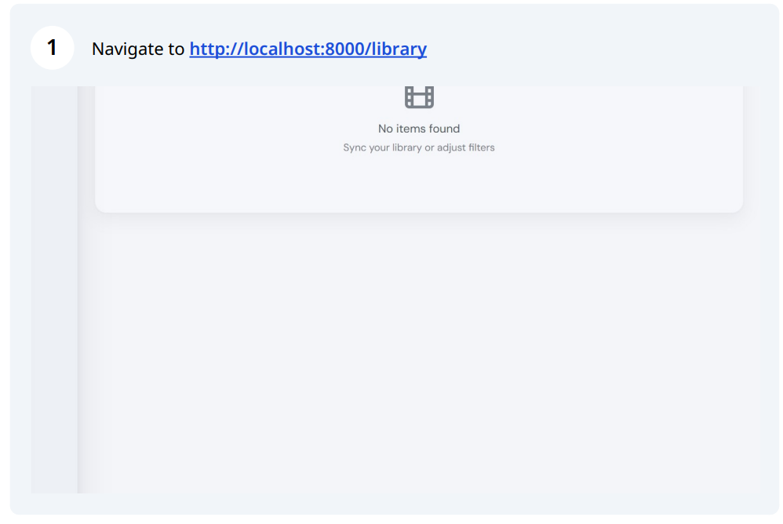

### 2. Click "Sync"
Hit the **Sync** button to import your movies and TV shows from Jellyfin.

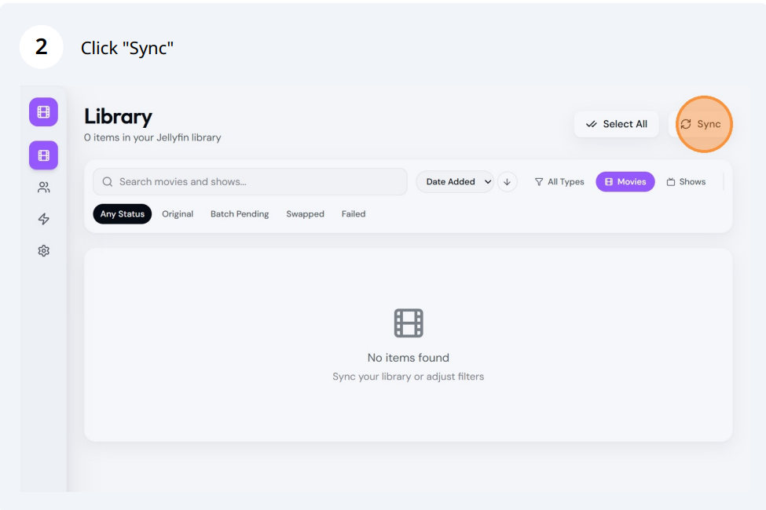

### 3. Add your faces
Go to the **Faces** page and upload face images, tagged by gender. The AI will match faces by gender when swapping.

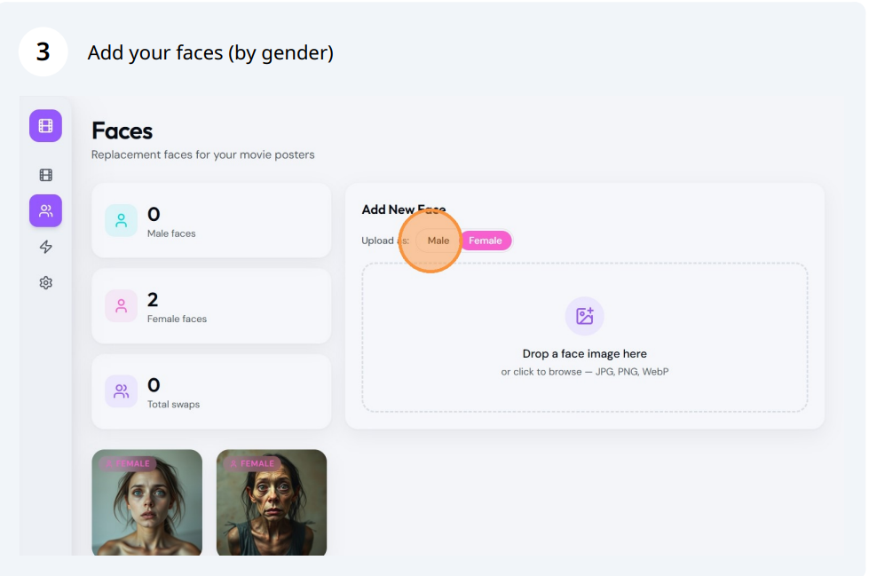

### 4. Select titles to swap
Back in the Library, click titles to select them. Use shift+click for range selection.

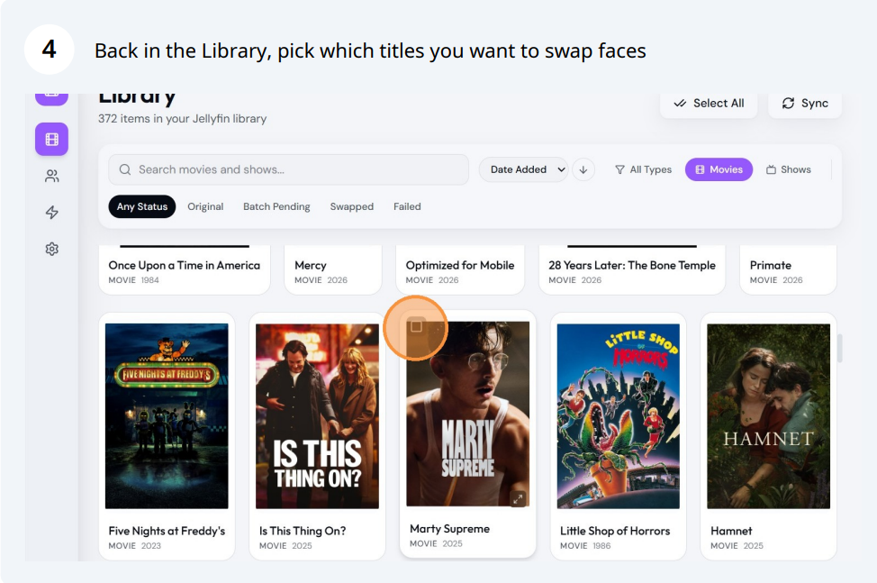

### 5. Click "Swap Now" or "Batch"
Choose **Swap Now** for instant processing, or **Batch** for 50% cost savings.

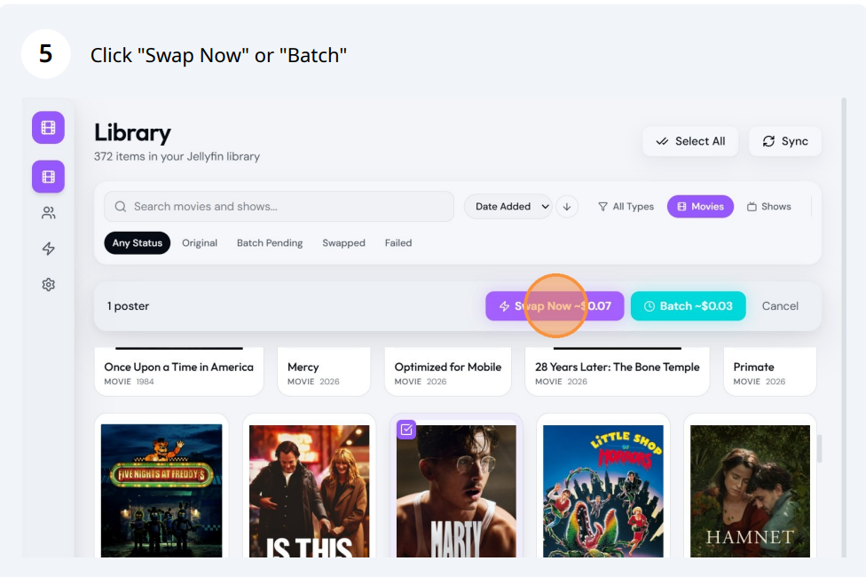

### 6. Confirm
Review the cost estimate and click **Confirm**.

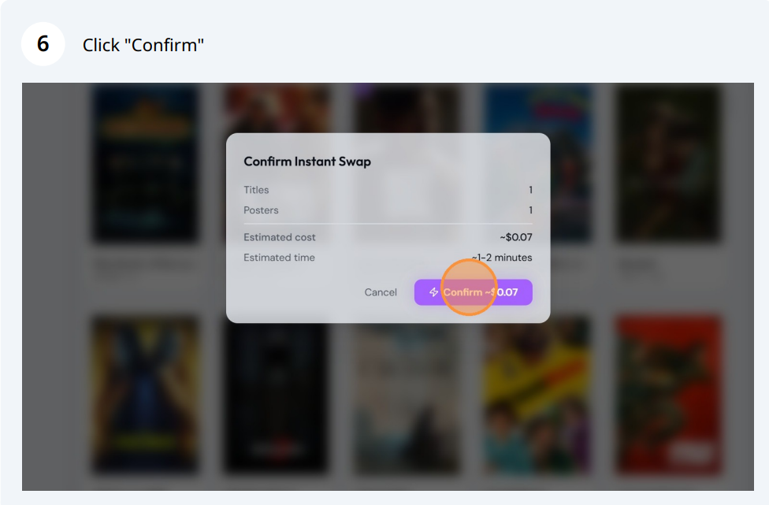

### 7. Monitor in the Jobs tab
Track progress in real time. You can close the browser — the server keeps processing.

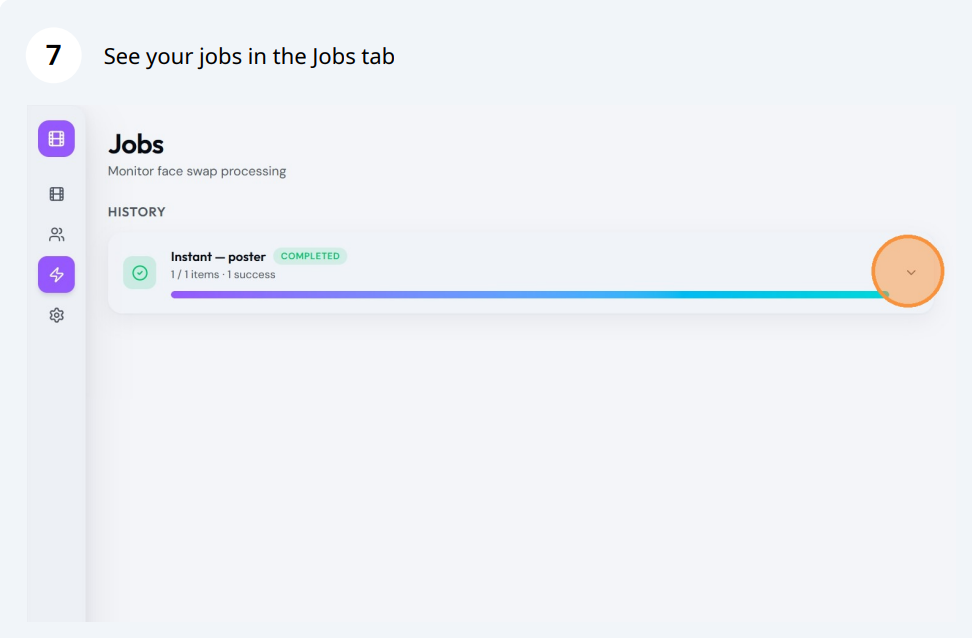

### 8. View job details
Expand a job to see per-title results with before/after thumbnails.

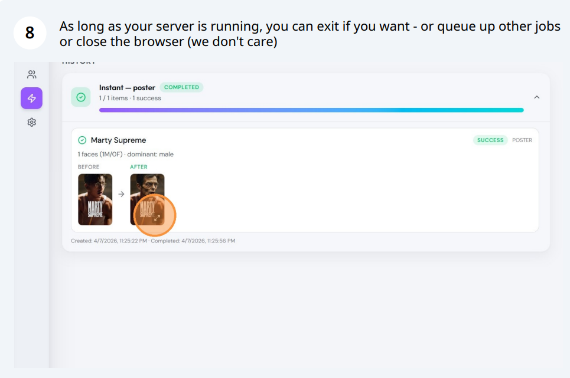

### 9. View the result
Click any thumbnail to see the full-size swapped poster.

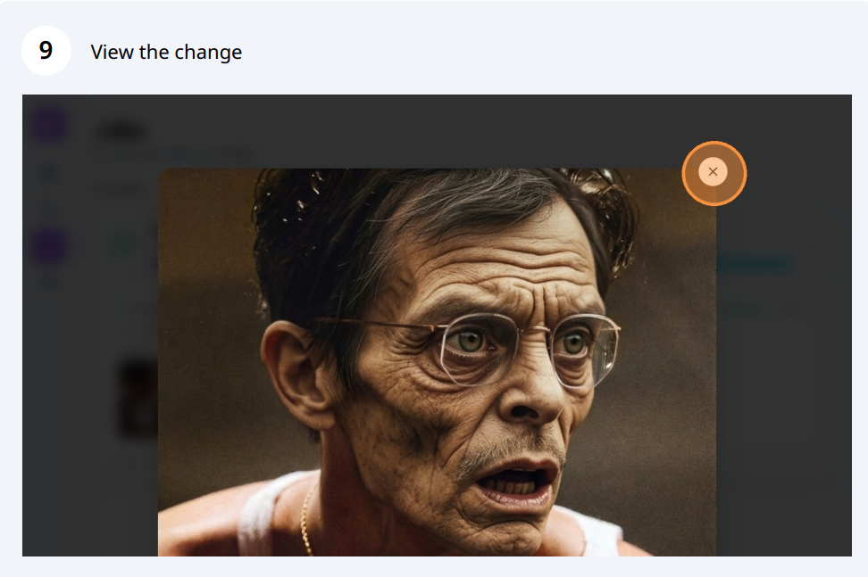

### 10. Filter by status
Use the **Swapped** filter to see all completed swaps.

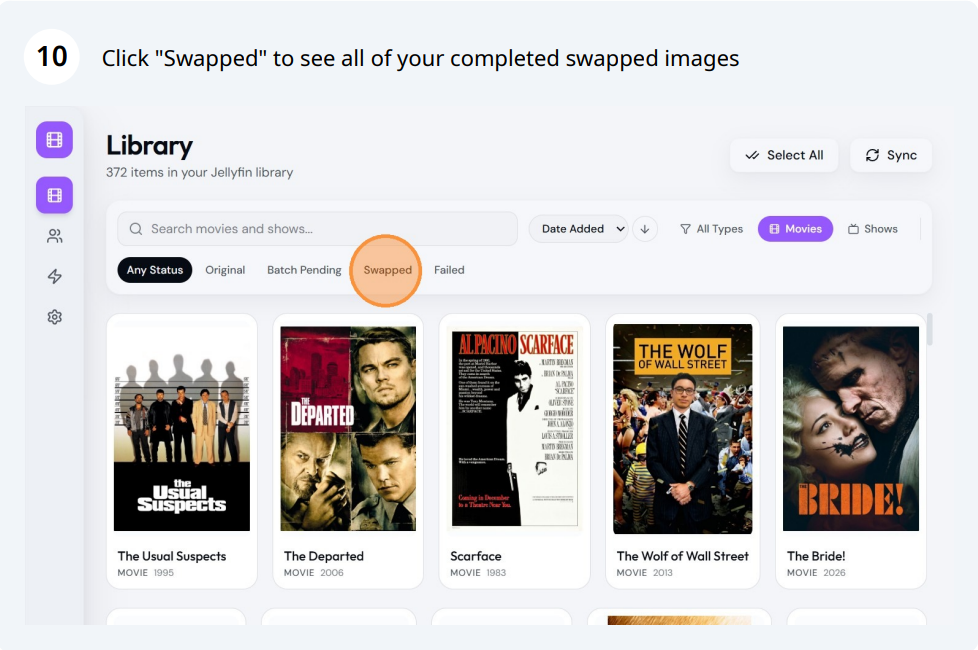

### 11. Find unswapped titles
Filter by **Original** to find titles you haven't swapped yet. You can also re-swap previously swapped titles.

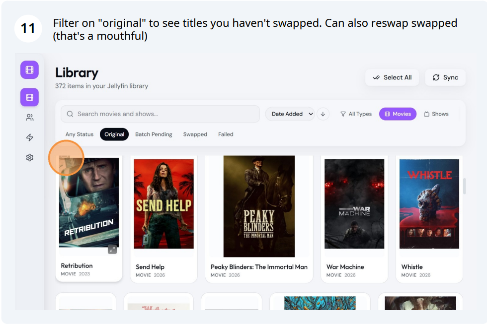

### 12. Cancel a batch
If you start a batch and change your mind, hit **Cancel** before it completes.

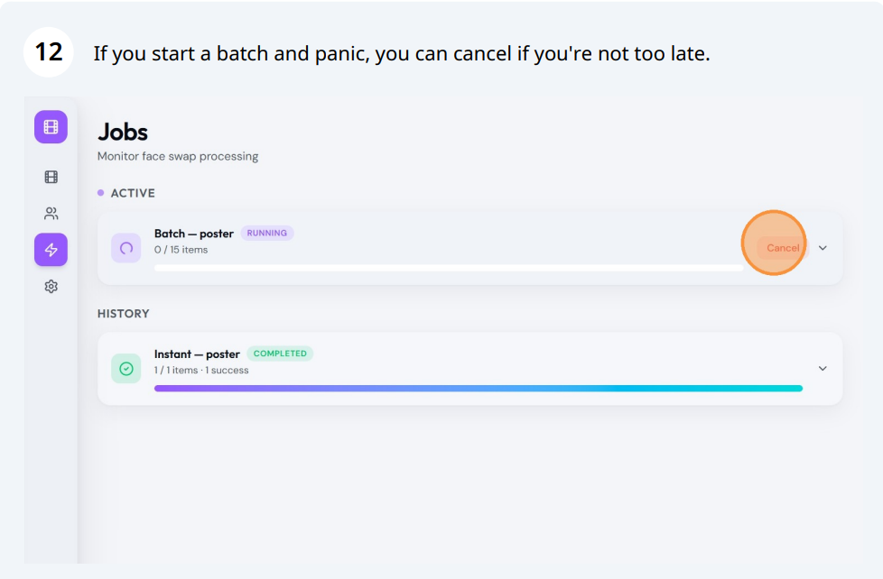

---

## Web UI

The web interface lets you browse your library, select titles, and swap faces with a few clicks.

### Library

- Browse all movies and TV shows with poster thumbnails
- Click to select, shift+click for range selection, or use Select All
- Search, filter by type (Movies/Shows) and status (Original/Swapped/Failed)
- Sort by name, year, or date added

### Face Swap

- **Instant mode** — process items concurrently with real-time progress (~20 posters per minute)
- **Batch mode** — submit to Google's Batch API at **50% cost**, results applied automatically (may take up to 24 hours)

### Jobs

- Track active and completed jobs
- Expand any job to see per-item results with before/after thumbnails
- Full-size image preview on any thumbnail
- Batch jobs show elapsed time and auto-apply results to Jellyfin

### Faces

- Upload and manage replacement face images
- Drag-and-drop upload with gender tagging
- Usage count tracking shows how evenly faces are distributed

### Settings

- Connection status for Jellyfin and Gemini
- Test connection buttons to verify your setup
- API keys are configured via `.env` file (never stored in browser or database)

## Authentication

Optional token-based authentication can be enabled by setting `AUTH_TOKEN` in your `.env` file:

```env
AUTH_TOKEN=your_secret_token_here
```

When set, all API requests require a `Bearer` token. The web UI will prompt for the token on first visit and store it locally. If `AUTH_TOKEN` is not set, no authentication is required (backwards compatible).

## CLI

For scripting and automation, a full CLI is included:

```bash
# Swap posters for all movies (dry run)
python cli.py --dry-run

# Swap the first 5 movies
python cli.py --limit 5

# Movies only, skip TV shows
python cli.py --movies-only

# Restore all originals from backups
python cli.py --restore

# Start the web server
python cli.py --serve
```

## Batch Mode

Batch mode uses Google's [Batch API](https://ai.google.dev/gemini-api/docs/batch) to process face swaps at **50% of the normal cost**. The trade-off is time — in our experience results arrive within about an hour, but Google's SLA allows up to 24 hours.

**How it works:**

1. Select items in the Library and click **"Batch"**
2. The app analyzes all selected posters immediately (fast, cheap)
3. Face swap requests are bundled into a JSONL file and submitted to Google
4. A background poller checks for results every 30 seconds
5. When complete, swapped posters are automatically uploaded to Jellyfin

Items show a **"Batch Pending"** status while waiting. The server handles everything in the background — you can close the browser and come back later.

> **Note:** The server must stay running for the batch poller to work. If using Docker with `restart: unless-stopped`, this is handled automatically.

## Backups & Restore

Every original poster is backed up to `data/backups/` before any swap is applied. Backups are named by Jellyfin item ID:

```
data/backups/
  abc123_poster_original.jpg
```

To restore originals:
- **Web UI:** Use the restore functionality in the Jobs page
- **CLI:** `python cli.py --restore`

## Configuration

All configuration is done via the `.env` file. API keys are never stored in the database.

| Variable | Required | Description |
|---|---|---|
| `JELLYFIN_URL` | Yes | Your Jellyfin server URL (e.g., `http://192.168.1.100:8096`) |
| `JELLYFIN_API_KEY` | Yes | Jellyfin API key (Dashboard > API Keys) |
| `GEMINI_API_KEY` | Yes | Google AI API key from [AI Studio](https://aistudio.google.com/apikey) |
| `AUTH_TOKEN` | No | Optional auth token for API access (if not set, no auth required) |
| `ANTHROPIC_API_KEY` | No | For Claude Vision as alternative analysis backend |
| `FAL_KEY` | No | For fal.ai as alternative face swap backend |
| `ANALYSIS_BACKEND` | No | `gemini` (default) or `claude` |
| `SWAP_BACKEND` | No | `gemini` (default) or `fal` |
| `HOST` | No | Server bind address (default: `0.0.0.0`) |
| `PORT` | No | Server port (default: `8000`) |

## Cost

Face swapping uses Google Gemini for both analysis and image generation.

| Operation | Cost per poster |
|---|---|
| Instant swap | ~$0.067 |
| Batch swap | ~$0.034 (50% off) |

A 500-movie library costs roughly $34 instant or $17 batch.

## Tech Stack

- **Backend:** FastAPI + Python 3.12
- **Frontend:** React + TypeScript + Tailwind CSS + Framer Motion
- **AI:** Google Gemini 3.1 Flash Image (analysis + image generation)
- **Database:** SQLite with automatic migrations
- **Deployment:** Docker (multi-stage build)

## Responsible Use

This tool is intended for personal use on private media servers. Please use it responsibly:

- **Only use face images you have permission to use** (your own photos, friends/family with consent)
- **Do not distribute modified artwork** — swapped images are for your private Jellyfin library only
- **Original artwork is copyrighted** — backups are created so you can always restore originals
- **Be mindful of your AI provider's terms of service** — review Google's [Acceptable Use Policy](https://ai.google.dev/gemini-api/terms)

The authors are not responsible for how this tool is used.

## License

MIT License — see [LICENSE](LICENSE) for details.
